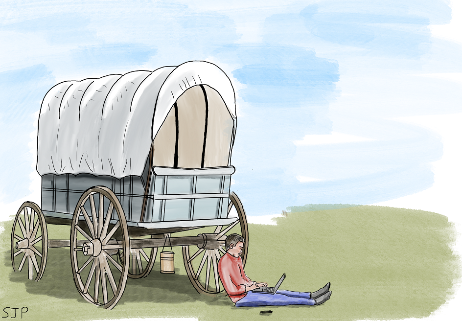

  

		<h2>Functional Programming in C#</h2>
		<h3>Oregon Trail Part One: The Feedback Loop</h3>
		

		
	
			

				
			

		
		

		

		<h4>Introduction</h4>
		
		
Hi, everyone.  I tried starting this blog up a year or so back, but it didn't quite take.  I'm having another go, and to keep me honest, I'm going to focus for now on one of my particular passions in development - functional programming.  Specifically functional programming implemented in C#.  Also drawing, that's been my Covid lockdown project.  I drew the pic at the top on my iPad.  Like it?

		
		
This first project of my relaunched blog involves another passion of mine - old computer games (the kinder word is "vintage").  And this time I really do mean <strong>old</strong>.  This particular game dates back to the early 70s.  It was developed on a university mainframe in America in 1971 by three guys that wanted to use it as an educational tool.  It ended up becoming a hit on the university campus, beyond just history students.

		
There was another version of the game developed in 1974, based on the original, which was distributed by a Minnesota educational company, but effectively this is a very early example of shareware from the pre-internet days

		
		
The game itself is text-based.  There's a simple set-up phase, consisting of deciding how much money to spend, followed by a series of days as the journey along the trail continues.  There are random encounters and the odd mini game.  The player's objective is to survive all the way to the end.

		
		
So this little project is a triple-win for me.  It's a challenge, a chance to stretch my functional programming skills, and it's something I might actually be able to play once I'm done.  I might even try and fix a few bugs in the original as I go along

		
		
This C# adaptation is based on the BASIC code for the 1974 version released by the Minnesota Educational Computing Consortium, which was re-developed from memories of the (tragically lost to posterity) 1971 university mainframe version.  The code can be found in all sorts of places all over the internet.  I'm hosting a copy myself <a href="oregontrail.bas">here</a>.  I learned to program for the very first time in ZX Spectrum BASIC, so this has been quite a nostalgia trip for me!

		
		<h4>Functional Programming</h4>
		
		
Before we start, a couple of notes on the basics of functional programming.  Why am I doing it & what does it involve?

		
		
Functional programming has been around since the latest 1800s in some form, and in computing since the 1960s.  This is a rough list of the adventages, it's:

		
		<ul>
			<li>Concise, compact and easy to read</li>
			<li>Robust, and like David Hasselhoff's singing career, nearly impossible to kill once it's in motion</li>
			<li>Super, duper testable - this is the big draw for a lot of people</li>
			<li>a big support if you want to run a ton of concurrent processes or move into containerised microservices</li>
		</ul>
		
		
Moving on now, what does it entail:

		
		<ul>
			<li>Once you set a variable, you can't ever change its state (Immutability)</li>
			<li>Functions pass around like variables (as in Funcs)</li>
			<li>No statements like If, When, For, ForEach, any of that stuff.  There're better ways of doing it.</li>
			<li>No state.  Functions only depend on their parameters, and nothing else (at least as much as it's possible to do that) </li>
		</ul>
		
		
Now that I've set the ground rules, it's time for us to start building a whole game this way...

		
		<h4>Creating the Input/Output Cycle</h4>
		
		
The first bit of code to lay down is the very basic structure of the application itself

		
		
When you think about it, a text-based game follows a fairly ridgid pattern: Display text -> Receive user Input -> update state -> Output to user.  And so on, until the game is completed.  We can't change the value of state objects, that's one of our rules, but we can use the super-funky new Record Types in the latest version of C# to easily create a new state object on each iteration, based on the previous one.

		
		
If anyone reading this has ever done much with Redux and React, then the functional system of maintaining state might seem familiar.  What you need to do is have a function (or set thereof) which takes the previous state, and a set of instructions as parameters.  It takes these, and determines the new state.  With no state to track, and everything simply being based on the previous operation, it's very easy to come up with unit tests to make sure everything is behavng correctly.

		
		
I created an enum to represent the player's progress through the game, so that we know fundamentally where we are.  As well as that, we need a few values that need to be tracked - amount of oxen, amount of ammunition, etc. and the text that the user should see on screen when they receive the new state - which will prompt them with the next intruction.

		
		
Here's my actual basic game-loop code:

		
			<pre>
				<code class="cs hljs">
public void StartGame()
{
	var firstState = new GameState();
	var firstTurn = this._turnMaker.MakeNextTurn(firstState, string.Empty);
	this._textDisplay.DisplayToUser(firstTurn.Text);

	firstTurn.IterateUntil(
			x =&gt;
			{
				var input = this._userInputCapture.GetInput();
				var nextTurn = this._turnMaker.MakeNextTurn(x, input);
				this._textDisplay.DisplayToUser(nextTurn.Text);
				
				return nextTurn;
			},
			x =&gt; x.IsGameFinished
		);
}
				</code>
			</pre>
			
			
Most of what this code is doing is pretty self-explanatory.  It's initiating an initial game state, feeding that into something that make a turn (i.e. advances the game world 1 move) and displays the results of that to the user.  We then iterate until the game is finished with that same basic process.  Capture input, update state, display to user.

			
			
You may notice however, the "IterateUntil" function in this code extract.  That's not part of C#.  That's here because there's an entirely indeterminate amount of stuff that has to happen between starting the game, and the turn on which it ends.  If I were writing normal code, I'd probably use a while(true) with a "break" statement somewhere to kill the process once we're ready, but I'm being functional.  I cobbled together a quick, generic extension method to provide that same functionality for me here:

			
			<pre>
				<code class="cs hljs"&gt;
public static T IterateUntil<T&gt;(
	this T @this,
	Func<T, T&gt; createNext,
	Func<T, bool&gt; finishCondition)
{
	var isFinished = finishCondition(@this);
	if (isFinished)
	{
		return @this;
	}
	else
	{
		return IterateUntil(
				createNext(@this),
				createNext,
				finishCondition);
			
	}
}
				</code>
			</pre>
			
	
This isn't perfect, as we're recursing, possibly for a very long time.  That can have a memory impact, since we're effectively holding all of those iterations in memory until the process completes.  Pure functional languages support Tail Recursion, which avoids that problem, but that's not a luxury we can necessarily have available to us in C#.  I'll be returning to this topic in a future article, so watch this space.  There are a couple of ways of getting what we want, but it's worth writing an entire article about.

	
	
This is our game state at this point.  Mostly storing how many turns there have been, the current text to display, and a few values that need tracking - like how much ammo we have so far.

	
			<pre>
				<code class="cs hljs">
public enum Request
{
	StartGame = 0,
	DoYouRequireInstruction = 1,
	HowMuchSpendOnOxen,
	HowMuchSpendOnFood,
	HowMuchSpendOnAmmunition,
	HowMuchSpendOnClothing,
	HowMuchSpendOnMisc,
	BeginGame
}
public record GameState
{
	public int TurnNumber { get; set; } = 1;
	public bool IsGameFinished { get; set; }
	public IEnumerable<string&gt; Text { get; set; } = Enumerable.Empty<string&gt;();
	public Request Request { get; set; }
	public int Food { get; set; }
	public int Oxen { get; set; }
	public int Ammunition { get; set; }
	public int MiscelaneousSupplies { get; set; }
	public int Clothing { get; set; }
	public int Money { get; set; }
}
				</code>
			</pre>
			
	
This bulk of the code I've written, however, is the engine for generating new states whenever we turn over.  That makes use of one of my favourite features in C# in recent years - switch operations.  This is basically a C# inplementation of a functional concept called Pattern Recognition.  I use the switch operation to determine the current in-game operation being performed, as well as whatever validation operations need to be applied - like has the user over-spent, or entered a number that's below 0 for something.  Part of the system for setting state is setting the next in-game operation to be performed, so I can set the player back to a previous part of the game if a validation process fails.

	
	
Here are a few examples:

	
	
			<pre>
				<code class="cs hljs">
Request.HowMuchSpendOnClothing when userInputAsInt < 0 =&gt; state with
{
	Request = Request.HowMuchSpendOnClothing,
	Text = new[]
	{
		"IMPOSSIBLE",
		string.Empty,
		string.Empty,
		"HOW MUCH DO YOU WANT TO SPEND ON CLOTHING"
	}
},
Request.HowMuchSpendOnClothing =&gt; state with
{
	Clothing = userInputAsInt,
	Request = Request.HowMuchSpendOnMisc,
	Text = new[]
	{
		"HOW MUCH DO YOU WANT TO SPEND ON MISCELANEOUS SUPPLIES"
	}
},
				</code>
			</pre>
	
	
Here I'm checking on how much the user spent on clothes.  If the value was negative - i.e. less than 0, then it's invalid and the player needs to move back a step.  Otherwise, we store up the value and move on to the next operation.<.p>