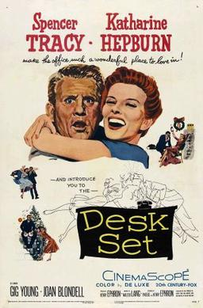
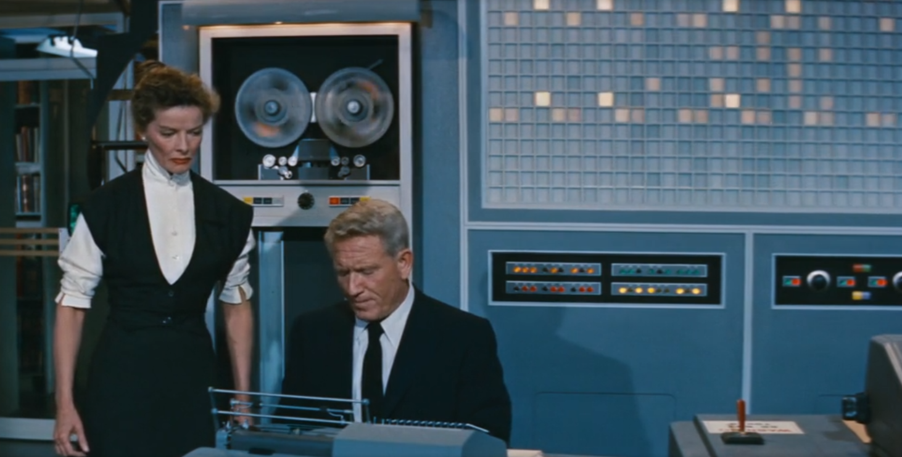
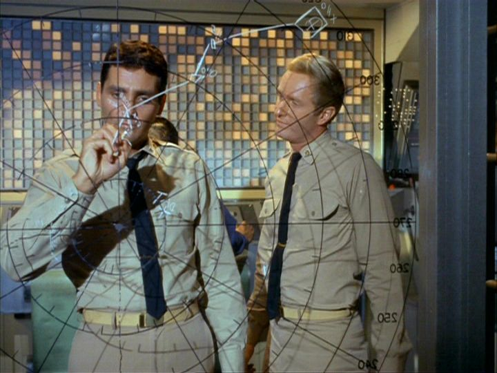

  

		<h2>Computing Films</h2>
		<h3>The Desk Set</h3>
		

		
	
			

				
			

This is the first post in a series I'm hoping to keep running over 2022 - Computing films.  I want to have a look at films made between now and somewhere around the mid-50s or so that feature computers or programmers promiently.  I'm going to look at not only are they good films in their own right, but also look at their representation of our profession is anywhere close to real

The first film I've picked is - so far as I can tell - the very first proper depiction of an IT technician in Hollywood.  At least, the first time they've been anything other than a small role or bit of stock footage in a rocket launch sequence.  If anyone knows of anything earlier, do let me know & I'll make sure to give it a watch.

<h4>The Plot

This is an old Hollywood romantic comedy featuring Spencer Tracy and Katherine Hepburn as the leads.  Two Hollywood legends, regularly cast together as they had a chemistry - to the extent that they became a real-life couple.  Tracy here is the computer scientist - Richard Sumner - the inventor of a revolutional new all-purpose computer called <s>ENIAC</s> EMERAC - The <strong>E</strong>lectromagnetic <strong>ME</strong>mory and <strong>R</strong>esearch</strong> <strong>A</strong>rithmetical <strong>C</strong>alculator.  "Emmy" for short.

The acting powerhouse that is Katherine Hepburn here plays Bunny Watson (no, I've no idea how she got that name) the head of the research department in a big firm of some kind.  It's never really explained what the company does.  The research department spend their time providing statistics and answering trivia questions over the phone .  They seem to be calls from journalists and non-fiction writers.  I don't know enough about the era to know if this is a real service that was provided, but I'm guessing it's a sort've pre-internet google.

The very basic plot is one that'll most likely seem familiar to anyone that watches many films from this era.  A man and a lady meet, instantly hit it off, but there is a mis-understanding that keeps them apart throughout the film, despite their obvious attraction.  In the final scene, the mis-understand is resolved and there is a round of love and marriage for everyone.

In our case, Sumner/Tracy has been brought in to computerise the office Hepburn/Watson works for, and she thinks he's there to make everyone redundant, but in reality he's there to provide a tool to help them in the big company merger & upscale that's coming.

<h4>Is it any good?</h4>

It's OK.  There honestly aren't any surprises, and the stakes never feel very high.  It's only a short film, though, so it's not like it's over-stretched or anything.  The leads are great, though.  Katherine Hepburn is always an incredible screen presence.  There's a scene towards the end where she has to slowly break down into tears while receiting the words to The Night Before Christmas over the phone.  It's a phenominal bit of acting.  Spencer Tracy is his charming best as the slightly bumbling Sumner, and game to appear a little rediculous here and there.

It's nice, gentle, easy viewing.  Unlikely to offend anyone, and it passes the time.  Considering this is the era of Marilyn, and the treatment of women in cinema in the 50s isn't always the best, it's refreshing that Sumner is attracted to Watson because of how awesomly clever she is.  She in turn seems to like him for his sense of humour and for being straightforward - something another man in her life isn't being.

The light nature of the film aside, it's charming, and enjoyable enough to watch.  I'm not sure I'd ever bother to watch it again, but I'm glad I did see it this once.

<h4>What about the Computer?</h4>

Here she is, in all her glory:

		
	
			

				
			

One thing I loved about this film is that pains are taken to show that the computer is both useful and no threat to anyone's job.  Sumner points out that the computer simply relays back information already fed into it, so that the researchers are free to spend more time gathering new data.  At the end of the film, Watson has shifted from hostility to genuine affection for "Emmy".  

The usual Hollywood cliches about computers tend to fall into one of the following categories:

<ul>
	<li>The computer is coming to take all of our jobs</li>
	<li>The soulless computer does not understand basic human decency, destroy it!</li>
	<li>The computer has inexplicably become sentient and now wants to Kill Us All</li>
</ul>

I'm very used to these cliches, as much as I love old SF films, so it's refreshing to have a positive portrayal of the computer for once.

As for "Emmie" herself, the set-builders and prop-makers obviously decided that a real computer was rather under-whelming on screen, and built something with a far more spectacular light show, more moving parts and some very space-age sound effects to represent it working.  I've read that these props and sound effects were recycled around a whole load of subsequent productions.  Here it is, for example, in the background of Journey to the Bottom of the Sea:

		
	
			

				
			

			

The script is accurate <i>in principle</i> to the abilities a computer would have.  They use it to retrieve stored information.  It can't deal qualitatively with the information it holds, simply regurgitate it back when queried.  It's said that the computer can make mistakes, but only if the human makes them first when entering the data.  This is all pretty much spot-on.  What they've built is a sort've natural language database, something the researchers can use to instantly call back prior work. 

The input device isn't really shown, but the actors read out natural language english queries while they type (or whatever) their request in.  Presumably it's a keyboard of some kind.  The output is a printer, there's no digital display.  We're a few decades away from that sort've hardware.  The natural language querying system isn't the slightest bit believable.  That's something that still has yet to be perfected (although we're arguably getting somewhere close), but still, they wouldn't have anything of the sort in the mid-50s.  That's been done to make the workings of the computer easier to understand for the audience, and as such it's a reasonable thing to do on film.  The flashing lights behind EMERAC are neat, but don't seem to serve any purpose whatsoever.

One other thing I like is that the operators and what are effectively the admins of EMERAC are all women.  Sumner introduces his colleage, Miss Warriner, as an Electronics expert, and it's she that is responsible for the smooth running of EMERAC.  This would seem very odd not even a decade later, but I belive it's entirely accurate.  Computers were seen initially as a form of calculator, which is part of the maths field, and women were often heavily involved with the maths areas of businesses.  It's great too, just to see a visual representation of a women in tech that isn't the lazy "super-hacker" cliche that seems to abound these days. 

An additional amusing detail is that EMERAC is sensitive to particulate matter in the air, so there's a scene where Miss Warriner has to warn the other ladies in the office off bringing dusty objects near it, or smoking in the room, for fear of disrupting the computer's working.  I don't know, but I'd guess that was a real concern of the time, and that's why you often see images of computer operators in white lab coats - so they can tell whether they're bringing dirt anywhere near the computer.

Despite the film's age, and how new Computers must have been at the time as a concept, this is close to being one of the most accurate depictions of Computing in Hollywood history

<h4>To Follow...</h4>

I'm aiming to do one of these reviews a month.  I'll try and vary it with newer and older films, more serious and sillier.  Please leave a comment if you have a particular love for War Games (which I've actually never seen) or Superman III or whatever....

