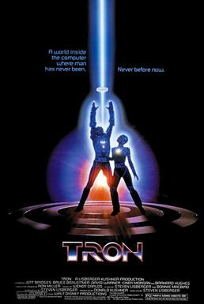

  

		<h2>Computing Films</h2>
		<h3>Tron (1982)</h3>
		

		
	
			

				
			

The second film in this series is the Disney's legendary IT-themed Science Fantasy epic, Tron.  You'd think, being a developer myself, that I'd have seen this years ago, wouldn't you?  Truth is I'm hitting 40 this year, and this is the first time I ever made myself sit down and watch it.  No particular reason I'd not seen it before now, it was just never on when I fancied watching it.  For those of you a little younger than me, in the bad old days before streaming media, you had to catch it on TV when it was there, or you missed it.  I can't decide whether I like that system more or less.  Anyway...Tron... 

<h4>The Plot</h4>

At its heart, Tron is not a million years away from Hollywood epics like Gladiator.  Our hero is a maverick software developer called Kevin Flynn (Jeff Bridges).  Some time prior to the events of the film, he developed an incredibly successful range of computer games, which another developer, Ed Dillinger (classy, classy British character actor David Warner) stole from him, took credit for, and used to establish sufficient reputation for himself that he became Senior Executive VP of the company, while Flynn was sentenced to spend his life working in an arcade.

Unbeknonwst to Flynn, Dillinger is taking his orders from a computer program called Master Control Program (MCP, another role played by David Warner) who started as a simple tool, then spontaniously developed sapience and a crazy hunger for power.  While Flynn breaks into the company building and attempts to steal evidence that the games were all his work, MCP blasts Flynn with a laser that converts him into a digital lifeform, and pulls him into the computer world - a bleak place popualted by living programs that are forced to fight in gladiator-like arenas on MCP's orders.

With the help of a program called Tron, developed by one of Flynn's friends (a pre-Babylon 5 Bruce Boxleitner), Flynn is able to overthrow the MCP, restore peace to the computer world and fight off the MCP's chief henchman Sark (David Warner, again).  And there was much rejoicing.

<h4>Is it anything like a real computer?</h4>

Nothing, whatsoever.  It has as much in common with real IT as JRR Tolkien's Lord of the Rings does with British History.  Where would I even start...

The most obvious is, of course, the idea of a computer world, inhabited by bipedal "programs".  Let's put that aside for a moment, I mean it's a representation of something beyond our comprehension in a way that makes some sort of sense.  Looking at it from a metaphorical perspective, is there anything even vaguely true about how computers work here?  Um...still no, sorry.

One of the more interesting ideas is that each program phyically resembles the developer that created it.  Flynn's program Clu is also played by Jeff Bridges.  Bruce Boxleitner plays both Flynn's colleague Alan Bradley and the program Bradley created, Tron.  The only real anomaly here in this is Sark, who looks like Ed Dillinger - who I'm pretty sure wasn't responsible for Sark.  This allows the writers to play with the idea that conflicts and relaltionships from the "real" world are reflected in alternate forms in the computer world.  Dillinger is a put-upon guy in a position of ostensive power, but is forced to do the bidding of the MCP, the same is true of Sark.  The same is broadly true of the other digital inhabitents with real-world counterparts.  There's a broad hint somewhere that programs contain some sort of creative "essence" of their original developers (here, slightly inaccurately referred to as "users")

As to accuracy...while it's true that software development is a creative endeavour, programs don't typically behave anything like their creators, or have any capacity for self-will. 

There is a slightly odd confusion in the film in how a program works.  The writers have paid much more attention to making the computer world seem like a real place, than in making it seem like an actual computer.  An example early on, Flynn sends his program, Clu off to hunt illicitely for some data on the company's corporate network.  When Clu is intercepted by the network's security software, the program then becomes unavailable to Flynn - effectively dead.  The major mistake here is that real programs don't "move" or leave the host computer.  They sit perfectly still where they are and pass requests on to other programs, who pass them on to other programs and so on, like a giant game of Chinese Whispers - except the information never degrades as it's passed around.  Flynn expresses frustration at Clu's demise, saying he was his "best one".  This makes programs seem more like Pokemon or something.  In reality, Flynn could have re-run Clu so many times as he liked, in the hopes of getting a better result.  The bigger risk would be the company tracking his home IP address from Clu's activities, and sending someone around to arrest him

It's also implied that every computer is somehow networked.  Flynn's arcade machines are used as battle arena's for programs the MCP wants out of the way.  I might be mistaken, but I'm not sure that was the case back in the 80s.

The other thing that stood out to me was the idea that a developer (Dillinger) could be raised up to the position of VP due to his successful game software, and idea that continues in the final scene, when it's implied that after finding his evidence of the games' true creators that Flynn has taken Dillinger's place.   How it was back then I couldn't say, but typically whenever I create software as part of my job, there's an understanding that it belongs to the company.  That seems to me to be an unlikely level of autonomy the company have given their guys.  

I'm intrigued to know what on earth this evidence of authorship Flynn expects to be able to find.  You'd think Dillinger would be clever enough to do a quick "Replace All" in the codebase to replace Flynn's name with his own.  Did they have source control systems back then?  Is Flynn doing the equivalent of looking back over the Repository Commit history to show he was the one that checked in the majority of the work?  It also begs the question of why Dillinger didn't destroy whatever it was?  Perhaps the MCP forced him to keep it, for use as a bargaining chip?  Who knows...

I'd like to make a final mention of one of my favourite details of the film.  Whenver the MCP finishes a conversation, he actually says "end of line".  I love that.  The "end of line" character is a real thing that's used in text to shunt the next thing written after it onto the literal next line down on the screen.  Strictly speaking, they're mis-using it in the film.  The MCP should really be using it after every paragraph he speaks, as well as at the end of whole conversations.  Honestly though, I love it too much to care.  It's a wonderful little detail.

<h4>Is it any good?</h4>

Yeah, I'd honestly say so.  It has a paper-thin plot, and the magical computer world is nothing like real IT, but it's still fantastically creative.  The early 80s graphic still stand up, considering it's meant to be a stylised computer world.  It's integrating the real-life footage of the actors that doesn't work quite as well.

Considering it's not an especially long film, the amount of world-building is impressive, and the scope feels pretty epic.  The casting is great too - especially the ever-awesome living legend that is David Warner.  I'd say he should be in more stuff, but I think he might actually have already <strong>been</strong> in just about every TV series ever made at some point.  I like the extra layers given to his villains, who don't for the most part seem to want to act like villains, but also don't have any choice in the matter.

I came away feeling like there's a whole load of potential for further stories in this world.  I'm surprised it never really became much of a franchise.  I know there was a sequel a few years ago, but I've heard tell it's not great compared to the original.  I'll probably give it a look at some point.

This is an entertaining film with a lot of creativity behind it, and with the good fortune that it's out-of-date aged graphics still match the style the film is trying for.

Don't spend too much thinking about how the film's world works or how it came to be.  It's a magic far-away kingdom with a bit of an IT gloss over the top.  It's just an entertaining old-hollywood-style epic, with some of the best graphics 1982 had to offer.  

End of line

