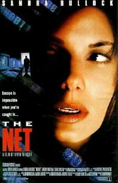
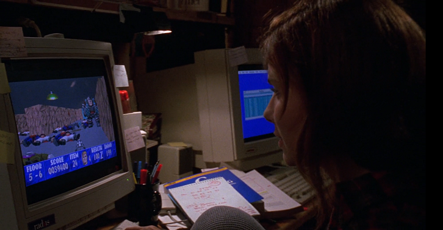
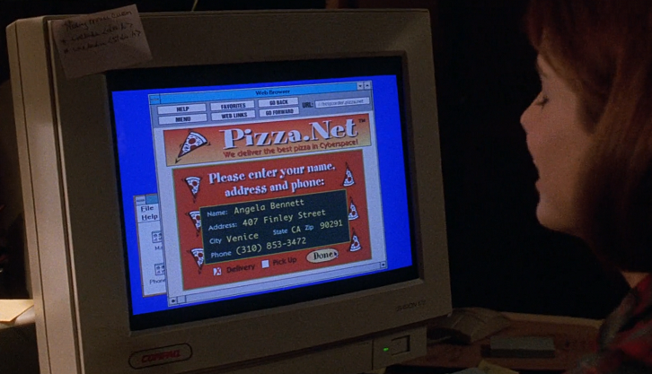
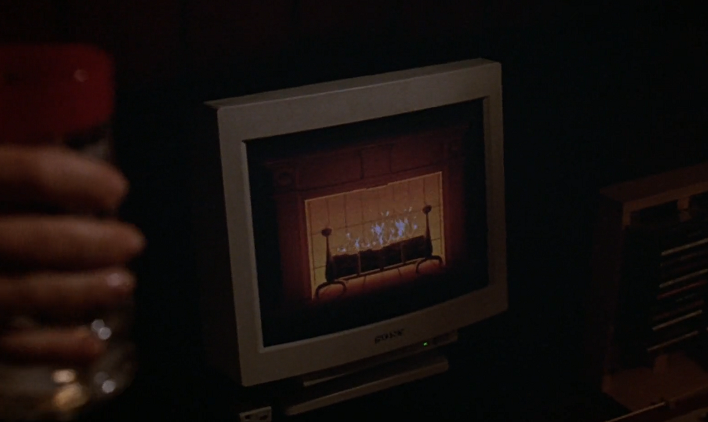
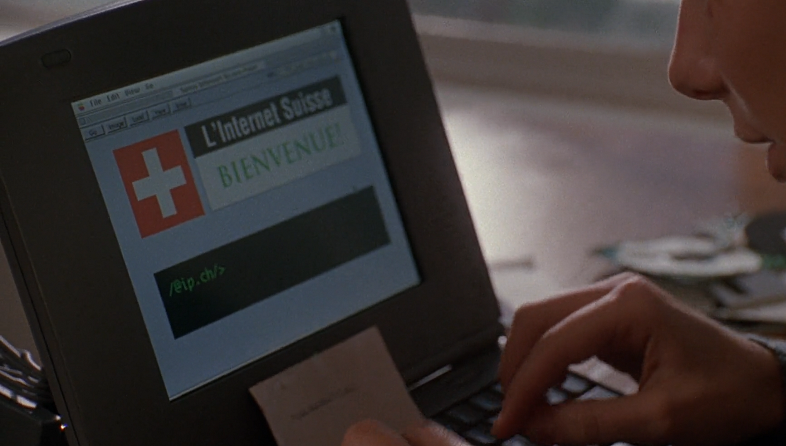
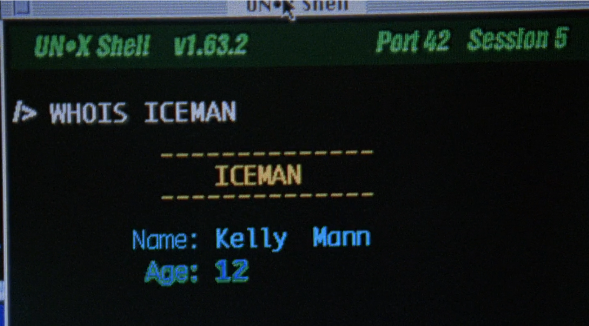

  

		<h2>Computer Films</h2>
		<h3>The Net (1995)</h3>
		

		
	
			

				
			

This is the third film I've looked at in this series on films about computers and IT.  Here are the previous articles if you're interested in reading more:

<ul>
	<li>Part One - <a hrf="https://www.thecodepainter.co.uk/blog/20220113/deskset">Desk Set (1957)</a></li>
	<li>Part Two - <a hrf="https://www.thecodepainter.co.uk/blog/20220208/tron">Tron (1982)</a></li>
</ul>

<h4>Introduction</h4>

Once, many years ago, when I was about 17 years old and doing a Computing A-level (that's a UK academic qualification we typically get at the age of 18) we were told that for the end of the semester we'd be treated to an easy day of watching a film, but it would have to have something to do with computers.  This was the year 2000, and the folks in my class were all eagerly anticipating a chance to sit and watch the Keanu Reeves epic, The Matrix, which had only recently come out.  Instead, our teacher looked slighly confused at this suggestion (having never heard of the film!) and pulled out a VHS copy of a Sandra Bullock conspiracy thriller - The Net.  This then, was how our last class of the semester was spent.  Was it worth it?  Let's take a look...

<h4>The Plot</h4>

Sandra Bullock plays Angela Bennett, a reclusive software developer (possibly, I'm not sure it's ever exactly spelled out what she does) who works from home, and has no real-life friends and a Mum with Alzheimer's-like symptoms.  Things are all turned upside-down for her after one of her colleagues inadvertently discovers what appears to be a backdoor into secure systems via an innocuous piece of software called "Mozart's Ghost".  Not only doesher colleague's flight crash mysteriously, but she finds herself the target of a shifty-looking English guy (because as Hollywood knows, we're all a bit shifty) who attempts to steal the software and then kill her.

After a narrow escape, she returns to find that there has been tampering with all of the government records that make up her life, and the US government now believes her to be a wanted felon called Ruth Marx.  With no way to prove otherwise, she has to go on the run in an attempt to foil the global conspiracy that is now persuing her.

After much hiding and unsuccessfully trying to get aid from the few people aware of her true identity, she finally finds a way to turn the tables on her persuers at an Apple Mac conference in San Franciso, and is able to reclaim her old life and return home.

<h4>Is it Anything Like Real Computing?</h4>

Well, for a start, how unrealistic is it to think that someone could be a productive member of a big IT company and work entirely from home, to the point that they've never even been seen in the office. I mean that's absolutely...erm...hmm...

And <strong>then</strong> there's the crazy idea that a software provider would be able to become all pervasive, have hooks in every part of our daily lives and be able to influence global politics in disasterous way.  I mean, that's just..hmmm...yeah...  It doesn't all seem quite as proposterous now as it did in the 90s, does it?

In a strange way, I'd say the big conspiracy content has gone from wild Hollywood plotting to strangely relevant in the last few years.  So I have to give the film some credit for that now.  I'm curious to know how commmon WFH was in the 90s.  Following the pandemic it's rapidly turning into a normal practice, but back when I was looking for a job in the early 2000s, it wasn't even a concept.  Not here in the UK, at least.

The film's also spot-on about people having online-only friendships.  That's definitely a thing. Though the film paints this as a tragic, sad character flaw.  Complete with a quoted section of dialogue from Tod Browning's Freaks ("One of us!").  I'm not surely that's really very fair.  One thing it does get right is that after identifying herself as female on a chat group, the men all start hitting on Angela immediately.  Yep, I'm almost certain that's somewhere close to real life.  For some reason she decided to also have all of her friends' chat messages get read out by text-to-voice apps that sound more than a little disturbing.  Not sure why you'd do that!

There are several things that do puzzle me about the film, though.  What exactly <i>is</i> the Mozart's Ghost app?  The dialogue - and the app itself - heavily imply it's a website, yet angela is sent it on a floppy disk and appears to execute it directly from that disk, like a desktop executable.  Come to think of it, how on earth would you pack the super-hacker, break into any system-type functionality into mid-90s style JavaScript.  I suspect it'd be more than a little tricky.  I'm fairly sure the film-makers either didn't know, or didn't care, about the difference between a desktop application and a website.

It's also unclear what the purpose of the Mozart's Ghost app is, and how it's intended to be used.  Was it created by the conspiracy?  Were they going to use copies of this innocuous app, which allows them to listen to gnarly 90s-style rock guitar noodling as they hack around the internet?  Presumably.  If that's the case, how on earth did it end up being debugged at a big software development company in LA.  Couldn't the crooks afford themselves a few contractors to get the job done privately?  The only other app we see Angela work on in the film is Castle Wolfenstein 3D which we're led to believe one of her clients developed.  What on earth does her company do?!?

<figure>
	
	<figcaption>See - Sandra Bullock is the true genius behind Castle Wolfenstein!</figcaption>
</figure>

The only actual fix we do is to identify that the version of Wolfenstein she's been sent it infected (somehow!) with a virus, which she proceeds to remove with some sort of low-level code editor which allows her to mess with what looks like machine code.  If this is a product her client is developing, a simple re-compile from source would have done.  Otherwise, downloading a fresh copy of the executable from the supplier would do just as nicely.  The film needs her to have a destructive virus for later though, which is why this scene exists.  Because her colleague improbably collects viruses.  For some reason.  To make things stranger, this virus is activated by pressing the ESC key.  Who developed this, and was it just for giggles?  I can only assume so.

She follows up her virus-scan victory by going to a website (with the slightly mangled url "//httporder.pizza.net") to order herself a home delivery of pizza.  That must've seemed like craziness in the mid-90s, but now...once again, we've finally caught up with this film

<figure>
	
	<figcaption>What a silly idea.  It'll never catch on</figcaption>
</figure>

If the virtual Pizza weren't enough, to show just how wierd and disconnected she is, she also has a computer app that turns her monitor into a replica of a nice, rawing fire.  Nearly every streaming platform around offers these in a variety of themes now.

<figure>
	
	<figcaption>Nor this.  What were they thinking!</figcaption>
</figure>

Her pizza of choice appears to be anchovies with a side-order of M&Ms.  I can't decide whether that's awful or genius.  Answers on a postcard with your opinions, please.

The basic premise of the film - that her digital life being tampered with can destroy her real life - is fundamentally sound.  If a little far-fetched.  This can only be carried out because the hackers have injected a trojan into the most popular piece of security software in America, which is used by all government departments.  Not only that, but they can only really erase Angela's identity because she's a total recluse.  She has no family (that remember her) and even her work colleageus don't know what she looks like.  Without that, the whole plan would fall flat.

Why go to these lengths to get to her in any case?  Why not just killer her?  That appears to have been plan A.  It's implied that the sinister English guy fancies her - could that be it?  He's keeping her alive in the hopes she'll come over to his side?  We even get the stereotypical "We're not so different, you and I" speech from him.  It's a very under-developed plot thread, if so.  The slightly OTT plot aside, it is still true that our digital lives are in many ways more "real" than actual life, at least in the effects they can have on us.

My favourite bit of strangeness is where she logs onto the "Swiss Internet", which she does via a website that comes complete with a CLI and a welcome sign in French beside a Swiss flag.  I wish it really were that easy and friendly!

<figure>
	
	<figcaption>The British internet probably has a picture of the King at a laptop or something</figcaption>
</figure>

I also wonder about the UI that the conspiracy guys have designed for themselves.  It's accessibly by entering a single, global password.  There's no user account system.  You know the password, you've got full admin access.  They don't have any method to close user accounrs or even know who's using the system.  When Angela is doing just that half-way through the film, the baddies know <i>someone</i> is in the system, and only guess it's her.  How are they planning to administer this?  It also appears to remember the last document you viewed since your last visit - and since there's only effectively a single user for the sytem, that means you see whatever the last user was up to.  In Angela's case, she immediately sees the incriminating evidence that was used to induce a politiician to commit suicide.  It doesn't even close documents down after you log off!  Very poor UX on this system.  No wonder they needed a software house to have a look at it.

What puzzles me further about the Mozart's Ghost thing is that after Angela logs into "The Swiss Internet", she finds that one of the websites she accesses (via Telnet, no less) has the same super-secret Pi symbol in the corner, which gives her the same password prompt she saw earlier.  So, is the "pi" back-door installed in every website?  If so, what does she need Mozart's ghost for?  What's on that disk that's not on all sorts of web servers around the US?  Does she have a super-secret version that includes the source code?  Once again, the film doesn't appear to understand how websites work.

Another misunderstanding about computer terminology comes shortly after this scene.  She uses the "whois" command in a unix shell to identify the real names of the folks she's chatting with online.

<figure>
	
	<figcaption>Iceman is actually a 12-year old girl posing as a man.  Did this film also predict gender fluidity?</figcaption>
</figure>

In real life the "whois" command is used to find out who's registered as the owner of a given URL - which is entirely public information.  One of the features of the internet - for better or worse - is that true anonymity isn't all that hard to achieve.  There's no way she should be able to do this.  Unless she's written her own program that hacks into government databases to fetch this from IP addresses.  In which case, why didn't the conspiracy come to her in the first place, she's obviously already able to do the stuff they're trying to do themselves!  The plot literally doesn't move without this scene though, which is probably why it exists.

The final bit of strangeness is that she realises the secret information she needs can only be accessed with access to her work Mainframe, which requires her to finally go on-prem.  In the film, she simply walks into her office without any worry about security.  No need for ID badges, or even a login to her workstation.  She simply strolls in and starts hacking.  With security practices that bad, it's no wonder the company is infiltrated by evil hackers.

<h4>Was it a good film?</h4>

Sure, it's a bit of fun.  Back in the mid-90s, paranoid, conspiracy thrillers were all the rage.  There were loads being made.  This isn't even the first that involved someone having their identity erased, I can think of at least a couple of other instances of this exact storyline.  Not having seen one of these sorts of films in a long time, it's a nice blast of nostalgia.  It's also amusing to look at all of the "high tech" computers at work 30 years on.

Sandra Bullock's performance is great, as you'd expect from her.  What annoyed me though, is that her character is really very passive for most of the film.  She runs into and away from things, she's saved by pure luck several times, and in a few cases is only in danger because of her own foolish choices.  This said, the last act of the film when she uses her own computer skills to turn the tables on the baddies is very satisfying.  I'd have liked more of this.  Less damsel in distress, and more cyber duelling.  There's an idea trying to break through here, but the film is just trying to make a by-the-numbers thriller, with computers as a bit of set dressing.

When it comes down to it, I'm not even sure what the evil hackers even want.  Control of the US government?  Tons of money by cyber-theft?  Leaked copies of the next script for the x-files?  I don't know, and they never say.

Is this film worth watching?  If you want to see a high-quality conspiracy thriller about hackers, I'd watch Sneakers instead.  If you want a light, reasonably entertaining film with some nice perforamnces and a few amusingly outdated bits of computing, then give this a go.

Until next time...

