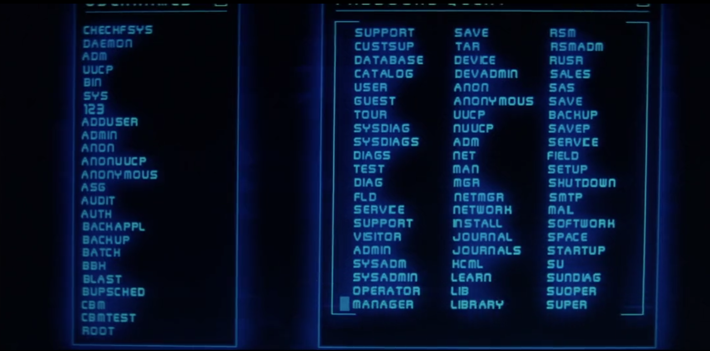

  

		<h2>Computer Films</h2>
		<h3>Swordfish (1995)</h3>
		

		
	
			

				
			

This is the fourth film I've looked at in this series on films about computers and IT.  Here are the previous articles if you're interested in reading more:

<ul>
	<li>Part One - <a hrf="https://www.thecodepainter.co.uk/blog/20220113/deskset">Desk Set (1957)</a></li>
	<li>Part Two - <a hrf="https://www.thecodepainter.co.uk/blog/20220208/tron">Tron (1982)</a></li>
	<li>Part Three - <a hrf="https://www.thecodepainter.co.uk/blog/20230102/computerfilms-thenet">The Net (1995)</a></li>
</ul>

<h4>Introduction</h4>

In the year 2001 I was going through university, planning to one day become a Software Engineer and turn my hobby into something I could actually make money from (spoiler: I did!).  It was about this time that I rented the film Swordfish for some Saturday night entertainment from a DVD rental place (remember those?).  I wasn't a professional techie back then, but even then I found the depiction of software developers in this film a little puzzling.  Looking back on it now, a few decades into the profession and it's still pretty mind-boggling.  It's probably about as close to real software development as Vertical Limit is to mountain climbing (that's the one where they're climbing with cannisters of Nitroglycerin on their backs, so there're plenty of explosions in the mountain climbing film).  

Let's have a look at it, and see if I can pick apart what's up with this particular entry... 

<h4>The Plot</h4>

Hugh Jackman is Stanley Jobson - a former hacker, now forbidden from going anywhere near a computer under the terms of his parole.  He wants to re-unite with his daughter, who's still in the custody of his ex-wife.  The film goes through a tedious amount of time hammering that he loves his daughter, but his ex-wife appears to be neglecting her.  He's contacted by Gabriel Shear (John Travolta) who is prepared to offer him a vast sum of money to write a piece of software to syphon a heap of US government money into Gabriel's account.  

As an additional Inscentive, Gabriel also kills Stanley's ex-wife, frames him for the murder, and kidnaps his daughter.  Stanley agrees to help, but attempts to double-crosse Gabriel by shifting the money on once again once obtained from the US government.  Nevertheless, after long action sequence in which many people fake their deaths, Travolta finally gets the money and goes off to become a vigilantee who goes around blowing up terrorists.  

Halle Barry is in it too, playing an undercover DEA agent.  Except she isn't.  Then she gets killed. Except she doesn't.  I don't know, and it's honestly nowhere near as interesting as it sounds.

Also, I'm not sure they ever actually explain why on earth the film is called Swordfish.

<h4>Is it anything like a real hacking?</h4>

Not really.  

For a start, everyone is very glamerous compared to real software developers.  Don't get me wrong, I've known a few devs who are snappy dressers, but honestly most of us...aren't.  Think glasses, beards, t-shirts and shorts and you're probably somewhere vaguely close a lot of the time.  In this film though, we're presented with two coders - impossibly handsome Hugh Jackman and this guy (who's called "Torvalds" - that's likely a reference to Linus Torvalids, the main guy behind Linux.)...

He dresses more like someone that  escaped from the set of Zoolander than anyone I've ever worked with.  Fine, though, this is a film.  Everyone has to look good.  I'll let it slide.  Mind you, Travolta's look is pretty odd.  I think he's trying to make himself look like an Egyptian Pharoe or something with that wig and beard.

How about the idea of Stanley Jobson, the genius hacker?  That's pretty far from the truth as well in all honesty.  Hacking - despite what Hollywood likes you to believe - is generally a lot easier than you'd imagine.  An awful lot of the purpetators are kids that have to be taken to court by their parents.  A lot of it can be done with off-the-shelf tools, in fact.  Now, the thing they're trying to do here is lift money out of a US government account.  I'd imagine that's a lot more difficult than DDOS attacks against random commercial websites.  To be honest though, rather than writing some kind of crazy complicated, miracle-working software to do it, they'd probably be better off conning it off the US government in the old fashioned way (i.e. Social Engineering).  

Moving onto some of the actual bits of computer talk.  Part of Jobson/Jackman's back story is that he introduced a virus to delay the development of  "Carnivore".  The US government's software, used to monitor communication over the internet.  This is actually real, would you believe?  It absolutely did exist, and was in use when this film was made.  They stopped using it in 2005.  That's not to say the US government had a crisis of conscience - they just switched to 3rd party software instead.  

Moving on to one of the first "tests" Travolta sets Hugh Jackman.  He's expected to hack his way into an US Department of Defence (DoD) website of some kind.  

He's told this is "dBase 128bit encryption".  I'm not entirely sure what we're saying here.  dBase is a piece of software for managing databases - is that what Travolta is suggesting the DoD are using behind their website, or whatever this login screen represents?  In fact, dBase isn't that commonly used any more.  That's not to say that the DoD might not have systems still relying on it.  Could be, but the bigger problems facing Jobson are things like network firewalls and whatever intrusion detection has been configured on the DoD's switches.  This is a bit like talking about the details of a Dragon's heart when you've still got the ribcage and armoured scales to consider be fore you worry about exactly where your arrow is going to hit.  It sounds impressive on screen, which is likely why it's there.

We then see a few moments of Jobson cutting a bit of code:

This looks like some variation on a Linux text editor with a few lines of low-level network communication code being written on the left, and some inexplicable IP addresses on the right.  Real hackers have toolkits of software they use - off-the-shelf products, and potentially a few of their own.  They don't sit and custom make a whole application in the 60 second Jobson is given here (while under some NSFW distraction at the same time).  Travolta suggests that Jobson is "sliding in a "Trojan Horse".  This is a piece of software installed secretly on a machine somewhere that allows the hacker back door access.  The usual vector for infection is somehow convincing the user of that machine to install it inadvertently - by getting them to click a dodgy link or open an MS Office document with code hidden inside it.  You wouldn't write it as a stand alone piece of software that somehow grants you access without first sneaking it onto the target network.  In fairness, Jobson says "Something like that" which is vague enough to allow for some wiggle room with regards the accuracy of what we're seeing on screen.  

The next computer screen we see is this, which appears to be some sort of file system.  Hard to tell which, but it tells me nothing except that Jobson is looking around for some file or other:

The reference to 128bit Encryption refers to the length of the key used to encrypt network communication.  In theory it would take years to brute force (i.e. try every possible combination) something encrypted like that, unless you make use of some other vulnerability, or convince someone to do something unwise that exposes the key to you.  Jobson doesn't touch email or the phone, so there's no way he's doing any form of social engineering.  He's working purely with code.

Travolta goes on to say that Jobson might be "hiding a worm".  A worm is different to a Trojan.  This is a piece of code that replicates itself around the various computers of a network.  Spreading like a virus.  This could suggest that Jobson's plan is to pass a worm onto the DoD network, which would spread around their network, installing it on every machine it can find until the correct one is found.  That machine would then signal back to Jobson's program, and grant it access.  I suppose.  The idea that this process could not only be coded, but also for the entire network traversal to be completed in 60s is frankly ludicrous.  Not only that, but that Jobson writes whatever he writes in a few seconds and then it works perfectly after a few tries.  I'm not sure I've ever written a piece of code in my life that worked first time without an hour or two of debugging at least.  

When queried later in the film, Jobson says he "cracked the code" after he "dropped a logic bomb through the trap door".  It immediately turns out this is untrue, but what <i>is</i> he saying here?  A "logic bomb" is a piece of malicious code that is inserted into the source code for a piece of otherwise legitimate software that triggers when a pre-determined condition is met.  Perhaps a date, or signal from the outside.  Halle Berry is right to be sceptical of this claim - there's no way he changed the source code anything on the DoD's network.  A logic bomb is something you might deploy after you've managed to get yourself surrupticiously onto the development team, and somehow added the additional code without anyone noticing.  That assumes there's no review process in the DoD, which I hope for the USA's sake isn't the case!

The "trapdoor" could be any number of things, but in context I'd guess it's something left in place by the development test that allows someone to bypass security for debug and test purposes.  Something that perhaps shouldn't have been left in the production system.  Very poor security practice on the part of the DoD if so!

Halle Berry next suggests that he used a "Password sniffer".  This is a piece of software that is used to pick up passwords being passed around in network traffic.  Not completely out of the realms of possible, we saw Jobson writing network communication code earlier.  Problem is however, that use of password sniffers tends to assume you're already in the internal network to be able to sniff the internal traffic for  tasty, tasty passwords.  Jobson is trying to get in in the first place, so once again I agree with Halle Berry's refusal to believe him.

The final explanation we get is that he simply "sees the code" in his head and can't explain it.  Boo!  This is the film skimming over how preposterous this all is and hoping we don't notice, or just accept it for what it is.

Finally, to add to all of the additional problems the film skips over - some US government departments have fake "honey pot" networks that allow you to think you're inside their top secret area, but in fact you aren't, and you're being monitored.  The DoD website in the film gives lovely, convenient "Access Denied" messages to every attempt Jobson makes except the last.  

Nope, sorry.  This is absolutely unbelievable.  

Oh, and I counted the "60 seconds" Jobson is given.  It's actually about 01:20.  It seems that even wildly unbelievably genius super-hackers like Hugh Jackman can't really do these things in 60s.  

Once Jobson has passed his "test", he's shown a computer set-up that he's in awe of:

This is a weirdly common Hollywood trope - confusing the monitors for the actual device.  Sure, that's a pretty impressive bank on monitors there, and I love the screen saver.  But the actual computer, we don't even see that.  I'd guess it's under the desk, just out of sight.

Travolta goes on to explain that they need Jobson to create a "Hydra" - a "multi headed worm, to sniff out digital footprints across an encrypted network".  To my knowledge, Hydras aren't a thing.  There's a bit of brute force password hacking software called "Hydra", but that's not what they're talking about here.  A "Digital footprint" is a trail left behind by a user or process as they perform actitivies around a computer network.  Not sure why they need a "multi-headed" worm to put these together when a worm by its nature is installed across many computers around the whole network anyway.  I think they just thought that "hydra" sounded cool, so they threw it in there.  

Jobson is told that the target system uses a "Vernam cipher".  This is a real thing - it's a system where each byte/character/whatever is encrypted according to a different key.  The sequence of keys would need to be stored somewhere, but provided those are never leaked to the attacker, the cipher is theoretically unbreakable.   This said, Jobson says that its "key is destroyed upon implementation" - bit of a slip, I think he means "following encryption".  Meaning that you use each sequence of keys once, then throw them away.  He continues "not to mention being a true 128 bit encryption".  Are there fake 128 bit encryptions?  He was hacking 128 bit encryption just a few scenes ago, why's he worried about it now?  Once again, we're just throwing around buzz words.

Halle Berry now takes him through the details of the very impressive set of monitors.  She says "it's not just a multi-screen system". Well, I'd hope not.  Lots of monitors are good, but they don't really mean a lot, excepting you can keep a lot of documents on display at the same time.  perhaps stick a film on one of them to keep you entertained while you work.  She goes on to say it has a "DS3 Connection" which allows them to "connect to 7 networks simultaniously".  DS3 (Digital Signal 3) is a telecommunications system for getting onto the internet.  I'm not sure what she means by "7 networks".  You'd normally need mutiple network cards to do that, rather than worrying about how you get onto the internet in the first place.  This is more meaningless use of IT jargon.

She goes on to say that it has an "encryption you'll have to crack in order to use it".  I've literally no idea what she's on about here.  You've encrypted your network so thoroughly that it can't be accessed except by cracking it?  This doesn't sound like an especially good practice to me.  

One detail I like - When Jobson greet Halle Berry with a "good morning", she corrects him to "good afternoon".  He's obviously spent all night working on his software, and has slept through the entire morning without realising.  I definitely know people like that!

Much later, Jobson is working on "finding" the worm.  I thought he was writing it for them?  In any case, he's finding it on the website of his old college, which appears to have an unencypted URL that consists entirely of an invalid IP address:

Any singal number in an IP address can't exceed 255.  The first number (octet) here is 271, so this is just something that's been dummied up for the film.  It's odd that they didn't use a DNS entry to give it a friendly name like "http://HughJackmansOldCollege.edu" or something.  Jobson clicks on a link to be presented with an RSA encruption logon screen, from which he says he can access the "only PDP-10 still active on the internet`".  A PDP-10 is an old mainframe system, and would probably date back to the 80s.  Despite that, it has some very impressive 3d graphics for its logon page, way beyond what an old 80s machine would be capable of!

We're then presented with Jobson's "Worm Generator Tool V.1.2", which appears to be standard post-Matric undecyphrable green text on a black background, which then resolves into some more funky 3D graphics.  Jobson obviously had far too much time on his hands, if he went to the trouble to create such an elaborate user interface for his tools.  Why bother when plain text is easy to work with?

Oh, and that text around the funky 3d diamond thing?  It's some sort of Linux shell script.  It' reading in a password file from "Josh" and then playing around with it in some sort of strange manner.  No idea, and likely just some random nonesense they found somewhere and thought would look good on screen.

The final bit of computer fun is the sequence in with Jobson puts together his code with his "Worm Generator".  What we see on screen is some random 3d graphics that bear no resemblence to what he's doing, but what I like is how he alternates between shouting at his screen in frustration, and smiling exstatically when things are working.  I can absolutely attest that real coding does feel a lot like that some times.

<h4>Is it Any Good?</h4>

Erm...no, not really.  It's pretty incoherent to be honest.  Travolta is obviously having a lot of fun with his part.  Hugh Jackman is pretty invested in his character too.  Halle Berry is...in the film.  The plot is pretty thin, though.

I found it a bit tedious that, in typical hollywood style, we have to make sure our character is utterly moral, whatever he does.  He's a hacker...except he did it to prevent the US government spying on US citizens.  He wants custody of his daughter...which is OK, because her Mum is a neglectful porn star with possible substence abuse issues, and she gets killed in any case.  He agrees to help evil John Travolta...but it's OK, he's doing it to get his daughter back, and he double crosses them at the end.  

The computer content of the film <i>barely</i> made sense when the terminology was used correct, and often wasn't even that.  A lot of it was just IT word soup, made to sound impressive.

They tried to make the world of cybercrime look cool, edgy and sexy.  Mostly it isnt though.  

There's a whole series of action scenes with fake-out deaths that never happened, betrayals, and things exploding for a variety of reasons.  It's all very flashy, but the story is pretty thin.

Watch it if you want.  It'll pass the time if you aren't feeling too picky.  It looks very slick, and it's certainly a film of its time.  The green "hacker" text on the computer terminals just screams "early 90s".  Don't expect great things, and you might well at least enjoy it.  

There are better hacker films than this one out there, though.  I expect I'll cover a few of them in due course. 

Until next time...
