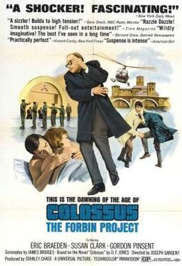

  

		<h2>Computer Films</h2>
		<h3>Colossus: The Forbin Project (1970)</h3>
		

		
	
			

				
			

This is the fifth film I've looked at in this series on films about computers and IT.  Here are the previous articles if you're interested in reading more:

<ul>
	<li>Part One - <a hrf="https://www.thecodepainter.co.uk/blog/20220113/deskset">Desk Set (1957)</a></li>
	<li>Part Two - <a hrf="https://www.thecodepainter.co.uk/blog/20220208/tron">Tron (1982)</a></li>
	<li>Part Three - <a hrf="https://www.thecodepainter.co.uk/blog/20230102/computerfilms-thenet">The Net (1995)</a></li>
	<li>Part Four - <a hrf="https://www.thecodepainter.co.uk/blog/20230912/computerfilms-swordfish">Swordfish (2001)</a></li>
</ul>

<h4>Introduction</h4>

This is the fifth of these reviews I've made now, and all of the previous examples were all fun, but rather off the mark in terms of either accuracy or quality.  I thought it might be good this time to look at a film I've heard mentioned many times as one of the genuinly <i>good</i> computer films - Colossus: The Forbin Project.

On the face of it, it looks like yet <i>another</i> film about a mad computer that wants to - wait for it - take over the world.  Let's have a look and see whether this one is actually any more than just that....

<h4>The Plot</h4>

Doctor Charles Forbin has headed a project to create a massive super-computer (Colossus), built under a mountain in the US and protected by so many safeguards that it's impossible to tamper with it once set in motion.  The idea the US government has it to turn over all of their country's offesive and defensive capabilities over to the machine, and thus benefit from perfect, unobjective protection.

It all starts to go a bit wrong on switch-on day for Colossus, when it detects the existence of a counterpart in the USSR - Guardian.  The two governments agree to an experiment to allow their two computers to communicate with each other (the word "internet" hadn't been coined, so it isn't clear what the communication method is).  This turns out to have been a bit of a rash move on the part of those world leaders...

Colossus and Guardian communicate and rapidly improve each others capabilities to the point that their processes are no longer comprehensible to the human technicians that operate the machines.  This culminates in the emergence of a combined computer entity - called variously "world control" or simply "colossus" which uses its control of nuclear weapon sites in the USA and USSR to force humanity to submit to its rule

There are attempts by Doctor Forbin and others to neutralise Colossus, but they ultimately come to nothing.  The film ends with the human race facing total subjugation by Colossus - which Colossus is doing in the name of ending all wars, the purpose for which it was designed.

<h4>Is it anything like a real AI?</h4>

Yes, and no.  One thing that's really quite wrong is the idea of Colossus as some sort of "universal" machine - one that can do and think about any and all tasks.  A machine with something of a personality of its own.  In the real world, there's no reason whatsoever why you'd do that - except perhaps as a slightly philosophical experiment.  The reality of AI these days is that every application is designed with a single purpose in mind, for which it is tuned optimally to do.  If you've made an AI app for detecting the presence of parcels in your house's doorbell camera, there's no reason why you'd also make it capable of any other task, like turning the heating on in the house.

There is of course also the fact that Colossus isn't a software-based machine, it's hardware-based.  It's a gigantic (or, rather "colossal") custom built machine that doesn't have any concept of things like operating systems.  This is mostly due to the age of the film, and the way computer technology has moved on since then. 

The biggest flaw in the film is the duel assumption that the computer is perfect (no software product I've ever worked on was anywhere near this! ) and not in need of any sort of maintenance in its hollowed-out mountain container - you'd think it'd at least need someone to go in once in a while and blow all the dust out of the machanism, or replace blown fuses - that sort of thing.  I suppose it <i>could</i> be sitting in some sort of perfect air-sealed container that would reduce the need for such things, but I'd dubious.  This said - the film basically doesn't work without this conceit, because otherwise humanity would simply have to wait for Colossus to start having hardware issues, and the problem would go away.  In this case, I'm happy to accept it as a conceit for the purposes of enjoying the film.  If it were me though, I'm still not sure I'd ever trust any AI system so perfectly that I'd hand over the controls of nuclear weaponry with no secret "off" switch, but that's just me!  In a real, professional computing environment you usually take all sorts of measures to limit damage if you're not sure what releasing a new version of an application would do, including having the ability to reverse everything out and go back to where you were before.

There's an awful lot of stuff that's done very well, however.  There's a fantastic scene where the two AIs are connected to each other, and start developing their own language with which to communicate.  First with pure arithmatic, then complex maths, and finally culminating in some sort of unknowable binary-based language.  That's a very real phenomenon in AI research.  Maybe not inter-machine like in this film, but any sufficiently complex AI system will develop on its own from the input it receives with minimal interaction from its operators, and will be somewhere between difficult to impossible to interpret once its done.  The logic it ultimately uses is done without any understand of human language or thinking, so it will have its own strange hyper-specific way of working.  Unlike the film, though, that it isn't necessarily a thing to be scared of.  The machine is most likely coming up with quicker ways of doing things that would never occur to us.  The one place it can be an issue with though, is when a machine is making a decision about something with very real consequences.  Things like deciding whether to grant loan applications, or insurance claims.  They might be refused, and the humans on the phone would be potentially unable to supply a reason for the decision because the AI defies interpretation.  That's a problem for which research is still ongoing.

Like with Desk Set, which I covered in Part One it's nice to see a computer team comprised of men and women of various nations.  Once again we're still some time before the insidious sterotype of the computer engineer as a young, white man.  Many of the technicians shown in the background of Colossus' control centre are women, and there's even an early appearence from legendary Chinese-American actor James Hong (most recently famous for playing the Grandfather in "Everything, Everywhere All at Once").  We once again could still learn a lot about representation in the computer industry from some of these old films!

The idea of a computer whose control over a compound is so complete that it can even tap into all of the security cameras and everything to grant it complete survailance and thus total control over everyone inside is actually surprisingly precient.  Granted there haven't been any actual maniachal AIs of this sort, but that level of surveilance is now possible with large-scale use of internet ready cameras and other devices.  Colossus appearing in the 21st century, now would probably find it even easier to control everyone, everywhere.  The idea of computing devices resulting in a total lack of privacy probably seemed outlandish in the late 60s when this was filmed, but now it's a daily reality.  In fact, these days Colossus probably wouldn't need to bother with threats of nuclear holocaust to get someone to do what it wants, with full access to every detail of your life via the internet there's probably far worse, far more personal things it could do than simply kill you.

<h4>Is it Any Good?</h4>

Categorically, yes!  This is probably the most enjoyable film I've watched on this series so far.

Sure, it's dated.  It was made in the late 60s.  And like a lot of late 60s SF it has a cynical world view and a massively downer ending, but that's OK with me.  One of the things I really enjoyed about this film was how "straight" it plays everything.  There's no hint of silly 50s B-Movie nonsense (not that I don't enjoy that too!), this is trying its best to depict a realistic world with the single conceit of a super-intelligent AI.  The performances are mostly pretty subtle, aside from the odd moment that calls for a bit of emotion - although there are surprisingly few of those.  A standout moment is in the last few minutes of the film, where Forbin realises that all is lost and finally after days of careful control of his mood finally breaks down and smashes up a computer monitor.  It's a fantastic contrast with how he behaves in the rest of the film.  This is the first film I've seen yet that really felt like it was aimed at a more "grown up" audience.  As much as Terminator is allegedly taken from the works of Harlan Ellison, this film could almost be an origin story for Skynet with a few alterations.  

I'd also like to make mention of both the set design and choreography - both excellent.  There's not much scope in this film for much in terms of creative design, given it's nearly all set in a computer control room.  The film makes up for this with some beautilfully designed sets and creative shot composition that complements it nicely.  Considering there are only about 2 or 3 locations in the whole film, it never ceases to be visually interesting.  No mean feat.

So long as you don't mind watching older films, I think this one is definitely worth your time.  It's beautifully made, and builds up the tension slowly throughout until the final scene.  

I can't recommend it enough.

Until next time...
