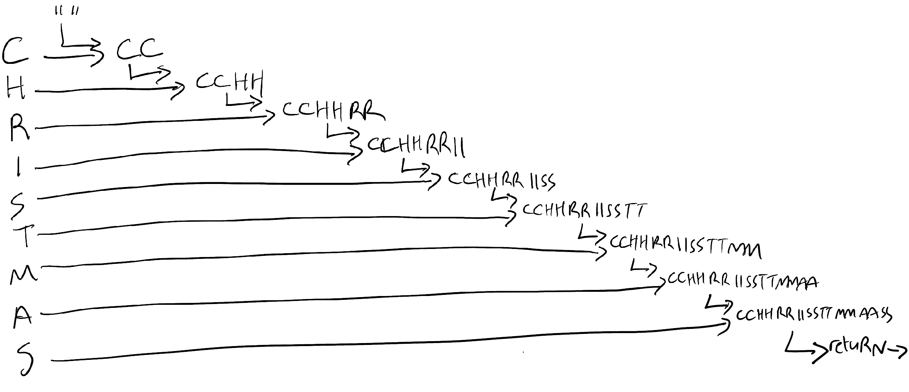
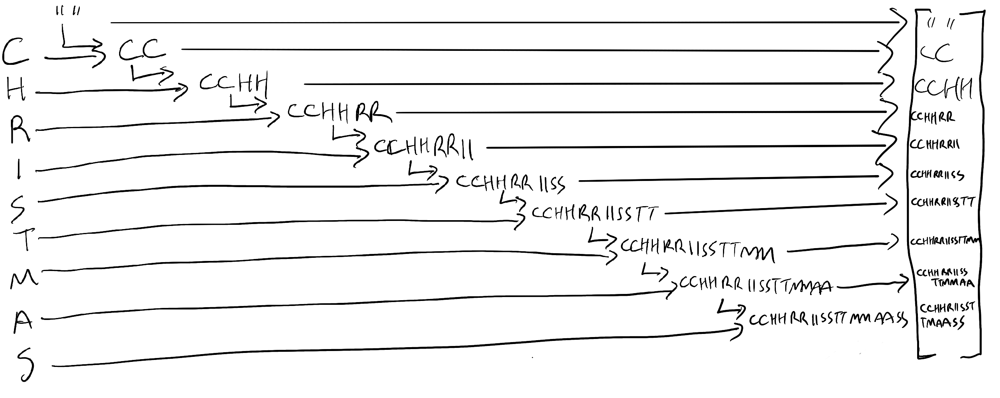

  

		<h2>Functional Programming with C#</h2>
		<h3>Scan and IndexOf</h3>
		

		
	
			

				
			

I've not updated this blog in a while because I've been pretty busy working on my book "Functional Programming in C#" which was published back in September by O'Reilly.  I"d hoped to keep this blog going at the same time, but there simply wasn't enough time for me to do both.  I'm hoping this will a new start, and hopefully I'll manage to keep to a decent schedule this time.

<h4>Introduction</h4>

This time I thought I'd treat you to a "deleted scene" of sorts from my book.  Or, rather, something I didn't manage to develop as an idea when I was writing the book.  

This technique pertains to a definite loop that might need to break early.  Just to define terms before we begin:

<ul>
	<li><strong>Definite Loop: </strong>A loop with a specified number of iterations - i.e. a ForEach or For loop</li>
	<li><strong>Indefinite Loop: </strong>A loop that iterates until a specified Boolean condition is met - i.e. a While or Do..While loop</li>
</ul>

A Definite loop is generally implemented in Functional-style C# with a Select statement, where we transform each element of an Enumerable into a new form, but what if that's not precisely what I want?  What if I want to reduce an Enumerable down to a single value?  There is the inbuilt Aggregate method (of which, more in a minute) but that doesn't cover all potential cases I might want to code.  This is where I have to introduce a couple of new methods into LINQ - one that has been available in F# since the beginning - Scan and IndexOf.  Used in tandem, these methods can be used to replace While loops in many circumstances.

<h4>First, Let's Aggregate</h4>

So What's a Scan?  It's actually going to take me a whhile to explain, but only a few lines of code to implement.  It's similar to the C# Aggregate function (known as a "Fold" in FP parlance).  I'll just briefly explain an Aggregate first, since surprisingly few people seem to know about it.

Aggregate is a way of reducing an array of things down to a single thing.  Let's work through an example of how it works.  A silly example.  Let's imagine that for some strange, barking-mad reason I wanted to duplicate all of the letters of the word "Christmas" to make it "CCrriissttmmaass".  No special reason I should, but it'll do for a demonstration.

To aggregate it, I'd start with a seed value - an empty string.  The aggregate process iterates through each item in the array (a string is also an array of characters in C#, and indeed many programming languages) and each iteration is supplied with the current running total, and the current item, and from them is expected to make a new running total.

The first iteration has a running total of empty string, and a current item of 'C', and we return 'CC'.  The second iteration has a running total of 'CC" and a current item of 'h', and we return 'CC' + 'hh', or 'CChh'.  This process continues with each item from the original string, until we've built our final string with every character duplicated.  This is what it looks like as a picture:

And here is the actual code:

			<pre>
				<code class="cs hljs">

[Fact]
public void Test01()
{
	const string input = "Christmas";
	var output = input.Aggregate("", (agg, x) =&gt;
		agg + x + x
	);
	output.Should().Be("CChhrriissttmmaass");
}

				</code>
			</pre>

Right, so that's aggregate.  Scan is similar, but with a significant difference.  Let me explain....

<h4>Scan</h4>

So, like Aggregate, Scan takes an Enumerable and iterates through it, while also holding a running total value which updates with each iteration.  The big difference though is what is actually produced at the end.  Instead of the final, accumulated total, the result is an array of every reeturn from every iteration.  You're basically seeing a step by step of how theh final total was built.  This gives me a chance to indulge in another of my favourite things - the works of legendary British singer-songwriter Kate Bush.  Check out this excerpt from one of her better-known music videos:

What you see her doing here is a single movement, but you also see each step of the movement superimposed over each other.  If you'd prefer an updated version of my previous illustration of the aggregate to reflect the workings of Scan, then it looks like this: 
 

Here's the code to implement your own Scan function:

			<pre>
				<code class="cs hljs">
public static IEnumerable&lt;T2&gt; Scan&lt;T1, T2&gt;(this IEnumerable&lt;T1&gt; @this, T2 seed, Func&lt;T2, T1, T2&gt; acc)
{
	var curr = seed;
	yield return curr;

	foreach (var i in @this)
	{
		curr = acc(curr, i);
		yield return curr;
	}
}
				</code>
			</pre>

If you want you can use it to get the aggregated duplicated character version of "Christmas", like this:

			<pre>
				<code class="cs hljs">

[Fact]
public void Test02()
{
	var input = "Christmas";
	var output = input.Scan("", (acc, x) =&gt; acc + x + x).ToArray();

	output.Last().Should().Be("CChhrriissttmmaass");
}

				</code>
			</pre>

So, what's the point of all this?  As you see above, you can get the final aggregated value by taking the last element of the array, but if that's what you wanted you'd be better off using Aggregate instead.  What if, though, we wanted to know when a particular state was reached in the process?  Let's imagine for a moment that I was asked to build up the string until it was 10 characters long, then stop the aggregation process?

The amazing thing about enumerables - which is what Scan evaluates to - is that they don't actually contain data unless you force them to.  They're just pointers to where the data may be found and how to get it until that point.  So, my Scan result - until I call ToArray/ToList or run a ForEach is just a set of pointers to code that is only data in <i>potential
 which means we can apply additional LINQ operations on top of it which will disrupt the flow of enumeration.  So if I wanted to get only the first 10 characters of my expanded Christmas string, I only need to do this:

			<pre>
				<code class="cs hljs">

[Fact]
public void Test03()
{
	var input = "Christmas";
	var output = input.Scan("", (acc, x) =&gt; acc + x + x)
		.First(x =&gt; x.Length == 10);

	output.Should().Be("CChhrriiss");
}

				</code>
			</pre>
			

Not only does this work, but because the First function breaks enumeration once its condition is met (i.e. the string is of length 10) the remaining iterations of the Scan process are left without being executed.  If you want to see that expressed in a unit test, look at this:

			<pre>
				<code class="cs hljs">

[Fact]
public void Test04()
{
	var input = "Christmas";
	var calls = 0;
	var output = input.Scan("", (acc, x) =&gt;
		{
			calls += 1;
			return acc + x + x;
			
		})
		.First(x =&gt; x.Length == 10);
	
	output.Should().Be("CChhrriiss");
	calls.Should().Be(5);
}
				</code>
			</pre>
			

Note that the number of times the iteration function is called is only 5 - because we doubled the number of characters each time so 5*2 is 10.  The remaining 4 characters of "Christmas" remain unexamined.  

